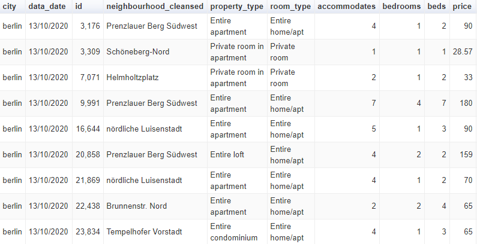
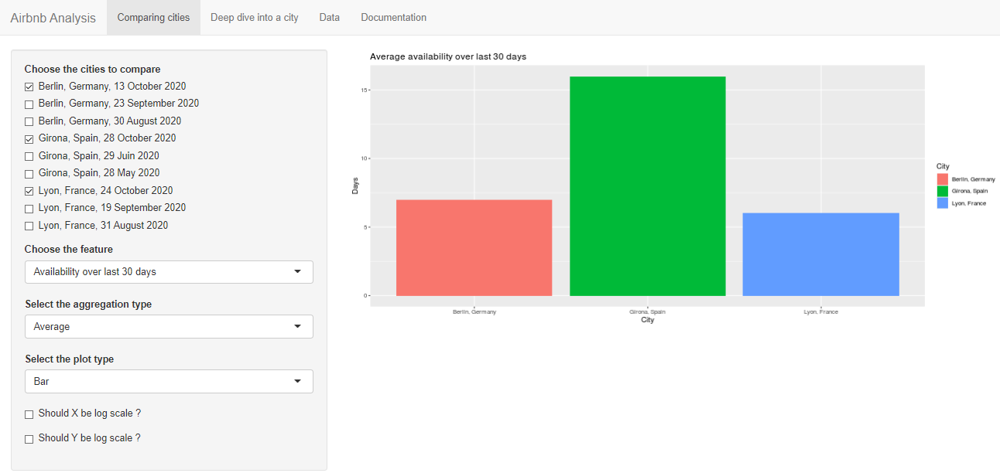
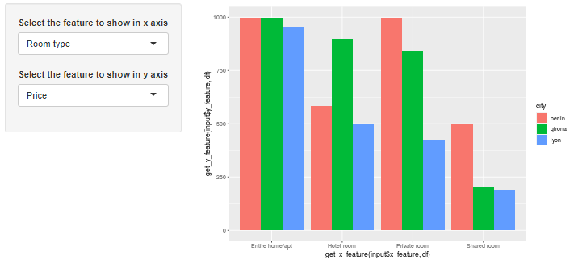
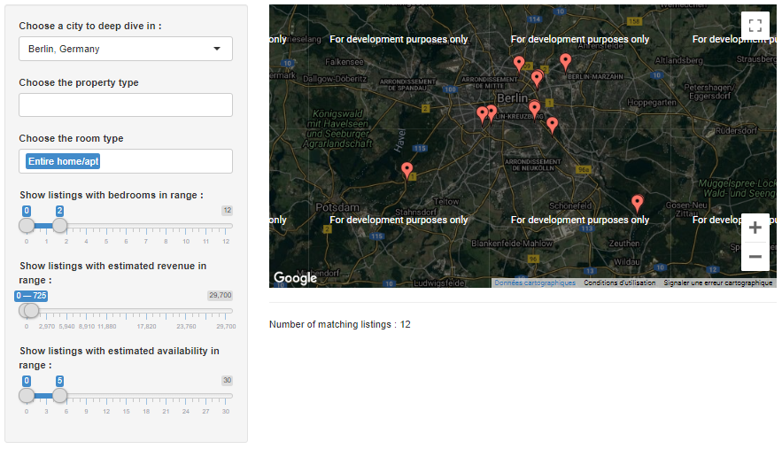
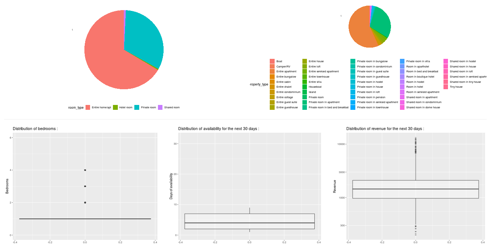

```{r setup, include=FALSE}
knitr::opts_chunk$set(echo = FALSE)
```

## Project presentation

In this project we are going to discover some Airbnb insights about three cities from data that you can find on  <http://insideairbnb.com/get-the-data.html> 

For this study we choose to analyze and compare three cities from three different countries: 

- Berlin in Germany
- Girona in Spain 
- Lyon in France

## A quick look over the data 

```{r cars, echo=FALSE, out.width = '100%'}

```

## Cities Analysis

In order to compare those three cities. We chose to keep only few elements of comparison which are: 

- the locations of each Airbnb: "latitude", "longitude"
- the property type : "property_type"
- the room type : "room_type"
- the number of bedrooms : "bedrooms"
- the price : "price"
- the availability over 30 days : "availability_30"
- the revenue over 30 days : "revenue_30"


## Use of Shiny 

To give some sense for this data we created a Shiny app to display some plot that helps to understand the data:


The app is divided in 4 tabs : 

- Comparing cities : Where you can compare cities with interactive plots
- Deep dive into a city : See with more precision what is inside a particular city
- Data : the table data
- Documentation : Instructions to get the app running on your computer

## Comparing cities

Inside the Comparing cities tab you can find two panels with several options each.

For the first panel you can compare two to three cities at the same time.

```{r plots, echo=FALSE, out.width = '100%'}

```

## Comparing cities 2
For the second panel you can compare two to three cities with more granularity adding more dimensions to your plot.

```{r granularity, echo=FALSE, out.height = '100%'}

```


## Deep dive into a city 

In this tab you can choose one city and get a closer look to the distribution of its values
```{r map, echo=FALSE, out.width = '100%'}

```

## Deep dive into a city 2

In this tab you can choose one city and get a closer look to the distribution of its values
```{r all, echo=FALSE, out.width = '100%'}

```

## Links for this Project

- Github : <https://github.com/L-HommeSage/Airbnb_Data_Analytics_Shiny>

- Shiny app : <https://pabantece2020.shinyapps.io/ece_2020_Airbnb_final_project/>
